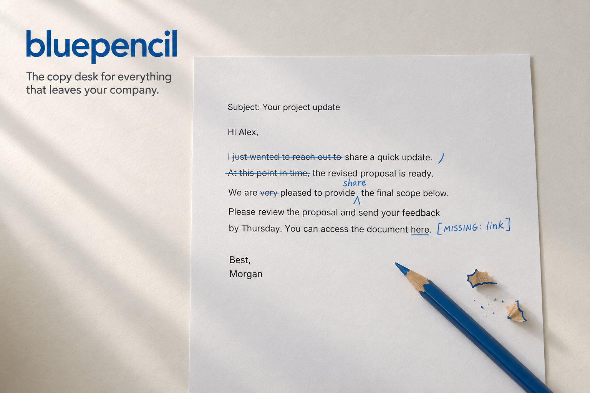

# bluepencil



**The editor every piece of writing in your company passes through before it goes out.**

bluepencil is an [OpenClaw](https://openclaw.ai) agent that owns one job: the copy desk. Humans paste drafts to it. Your other agents send it theirs. It hands back ship-ready text in your company's voice, with every change listed and explained. It never publishes anything — you do.

Not a censor. A blue pencil shows its marks.

## What it does

- **Edit** — you wrote it; it gets tighter and clearer and still sounds like you.
- **Rewrite** — an agent wrote it, or it reads like boilerplate; it gets rebuilt in the company voice for the channel it is going to.
- **Anti-slop pass** on everything: the tells of machine prose come out.
- **Channel shapes** for email, Slack, web copy, social, pull requests, support replies, changelogs.
- **One voice, on disk.** `voice/PROFILE.md` holds your company's voice as rules with quoted evidence. Every human and every agent that writes gets the same editor.

## What it never does

- Invent a fact, name, number, price, date, quote, or customer. Gaps stay visible as `[MISSING: …]`.
- Send, post, push, or reply on your behalf.
- Change what you meant.

## Multiplayer by design

bluepencil is built for OpenClaw 2.0's shared sessions:

- **People** join one shared *editing desk* session. Give teammates *Suggest* or *Draft* rights and the workflow enforces itself: bluepencil drafts, a human ships.
- **Agents** call it with `sessions_send` and get the finished text back in the same turn. Put it in front of your SDR agent's emails, your recruiter agent's candidate replies, your engineer agent's PR descriptions.

Every draft it touches is saved with source, result, and change list side by side, so you can always see what was changed and why.

## Install

You need an OpenClaw Gateway (2026.9 or later).

```bash
git clone https://github.com/yasuhito/bluepencil ~/bluepencil
```

Register it as an agent (JSON5, in `~/.openclaw/openclaw.json` under `agents.entries`):

```json5
bluepencil: {
  workspace: "~/bluepencil",
  identity: { name: "bluepencil", emoji: "✏️" },
  model: { primary: "anthropic/claude-opus-5" },   // any strong writing model works
}
```

Allow your other agents to call it (`tools.agentToAgent.allow`), open a shared session for the team, and paste one piece of writing you like. bluepencil builds the voice profile from it and starts taking work.

## Calling it from another agent

```
sessions_send(agentId: "bluepencil", message: "Rewrite for email:\n\n<draft>")
```

The reply is the finished text first, then a short change list. If bluepencil had to mark anything `[MISSING]`, it says so on the first line after the text.

## Layout

```
AGENTS.md            operating instructions
SOUL.md              how it thinks
IDENTITY.md          name, role, look
skills/              edit · rewrite · anti-slop · voice-profile · channel-drafts
voice/PROFILE.md     your company voice (rules + quoted evidence)
voice/samples/       writing you approved
drafts/              every job: source, result, changes
shipped/LOG.md       what actually went out
```

## License

MIT. See `LICENSE`.
